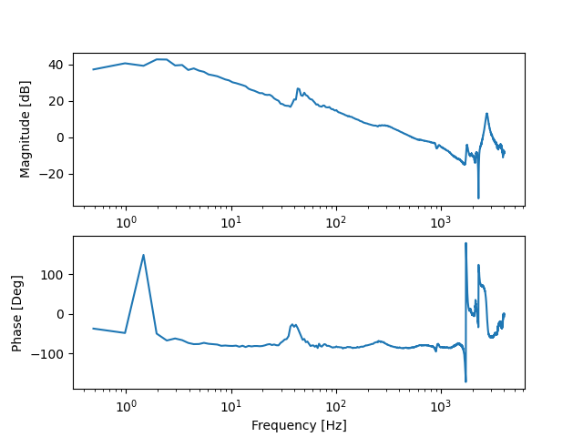
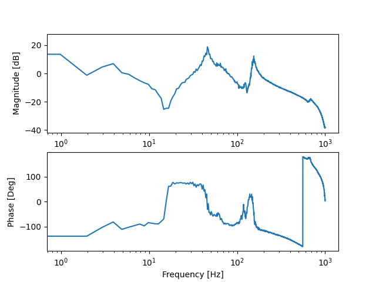
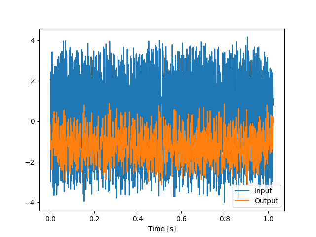

# Trace Tools

A python library for parsing and working with trace files from Siemens Sinumerik CNC system.

You can parse:
* Trace files - That you configure under the "Diagnostic" meny
* Frequency measurements and step responses - From the "Setup/Optimize" meny
* Autotuning results - After finishing an autotuning, you can save the "auto-tuning result", this file contains the sugested control parameters and the frequency responses.

## Files in repo

* `TraceTools.py` Main file, import this and use the functions to parse different type of files.
* `tracetypes.py` class definitions of what the measurment files are parsed to.
* `b85.py` used for decoding their non standard implementation of ASCII 85.


# Automatic Servo Tuning files (AST-Files)
AST Files can be saved at the end of performing an auto-tuning of an axis.
These contains the frequency response of the mechanical system and current control. It also contains all the control parameters for the servo-drive.

Example code for plotting the mechanical frequency response.
```python
import tracetools as tt 
import matplotlib.pyplot as plt

ast = tt.parse_autotune_file(r'traces\ast_file.xml')

tt.plot_freq(ast.plant_freq_response)
plt.show()
```


You can also read out the control parameters computed by the AST.
```python
import tracetools as tt 
import matplotlib.pyplot as plt

ast = tt.parse_autotune_file(r'traces\ast_file.xml')
print(ast.speed_ctrl_params)
```

```
SpeedCtrl(Kp=0.2160315604218958, Ti=0.01, Ts=0.00025, 
            ref_mdl_active=True, ref_mdl_freq=146.35482877622718, 
            ref_mdl_d=0.7071, ref_mdl_delay=0.0, 
            act_value_filters=[], 
            current_setp_filters=[PT2(freq=2000.0, damping=0.7071)])
```

To see what is parsed from the AST-file, check the `tracetools/tracetypes.py` file.

# Frequency measurement files
Appart from auto-servo-tuning, one can also do stand-alone frequency measurements. These can also be parsed, but they do not contain the servo-drive parameters. However, they do contain the timeseries signals that are used to compute the frequency measurement.


```python
import tracetools as tt 
import matplotlib.pyplot as plt

freq_meas = tt.parse_freq_meas_file(r'traces\freq_trace0.XML')
tt.plot_freq(freq_meas.plant_freq_response)
plt.show()
```




One can also read out the time data used for computing the frequency measurement.
```python
import tracetools as tt 
import matplotlib.pyplot as plt

freq_meas = tt.parse_freq_meas_file(r'traces\freq_trace0.XML')

ts_in = freq_meas.input_time_series[0]
ts_out = freq_meas.output_time_series[0]

plt.plot(ts_in.t,ts_in.values,label='Input')
plt.plot(ts_out.t,ts_out.values,label='Output')
plt.xlabel('Time [s]')
plt.legend()

plt.show()
```
